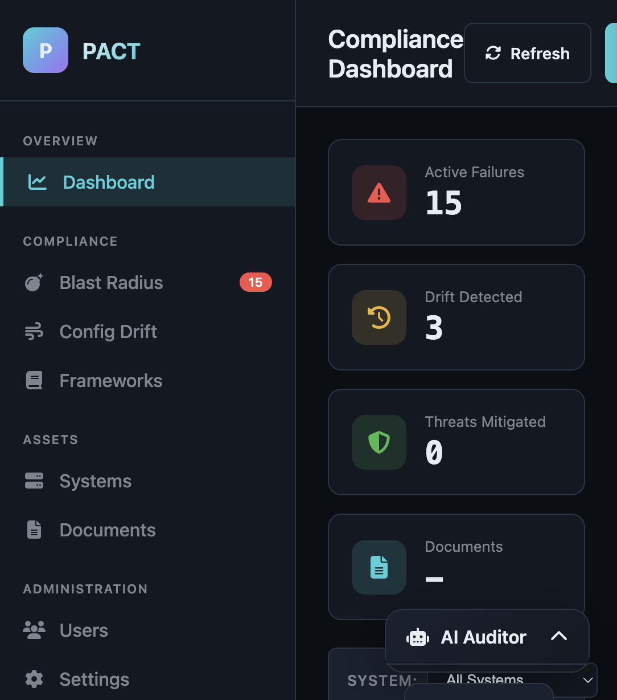
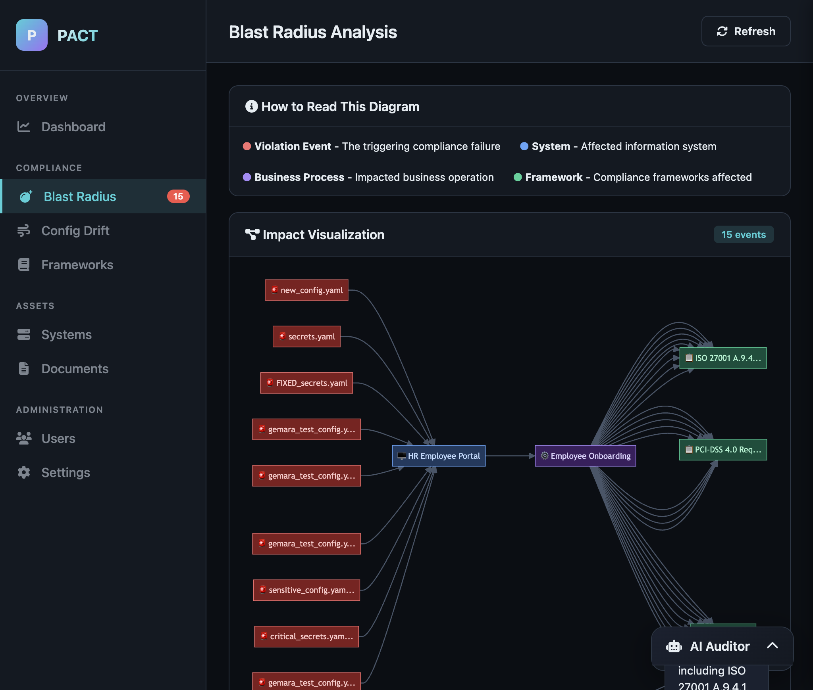
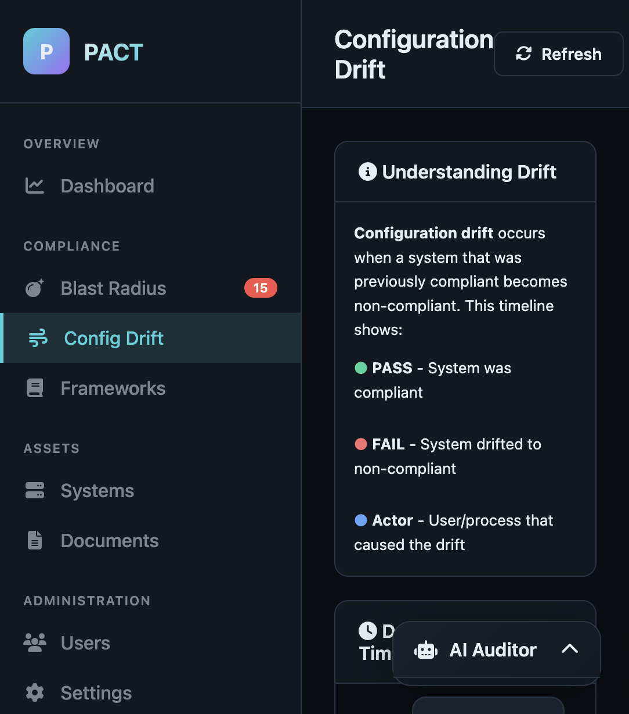
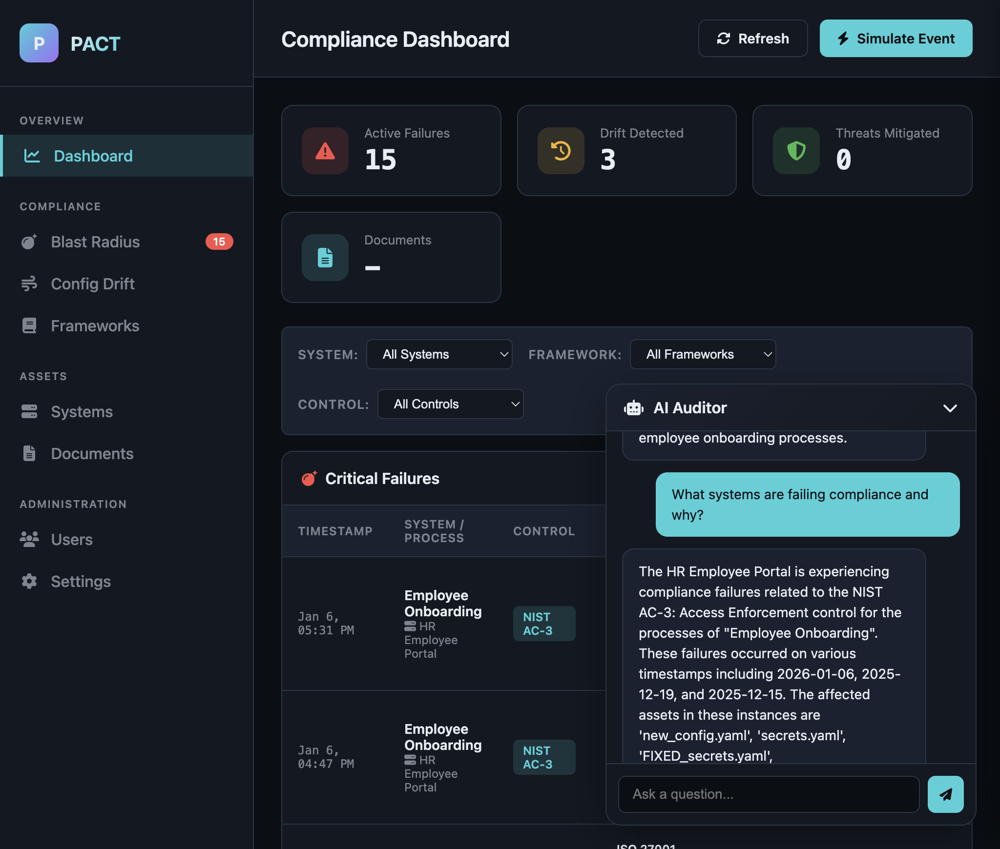
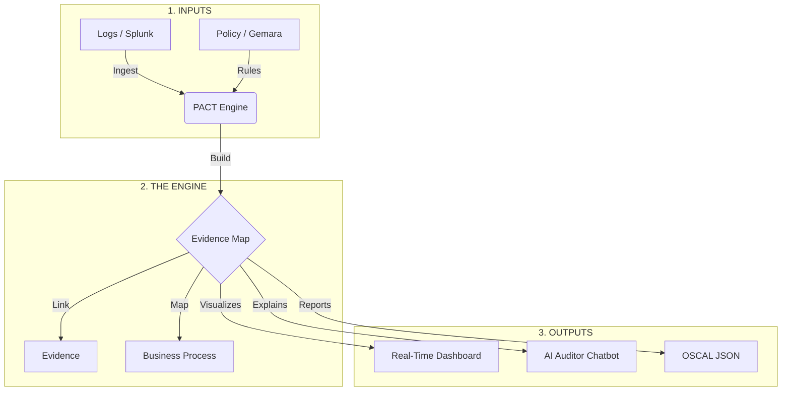

# PACT: Policy Automation and Compliance Traceability

**PACT watches your systems 24/7, or scans on-demand, and tells you—in real-time—when something breaks a compliance rule, who did it, and how to prove it to auditors.**

No more chasing spreadsheets. No more "it was compliant last month." PACT gives you continuous, traceable proof of compliance.

---

## Who It's For

Security engineers, compliance officers, auditors, system owners, and executives who need to answer **"Are we compliant right now?"** without digging through spreadsheets.

---

## The Problem vs. The Solution

| The Old Way | The PACT Way |
| :--- | :--- |
| **"It was secure last month."** Compliance checks happen once a quarter. | **"It became non-compliant 5 minutes ago."** Continuous monitoring catches issues immediately. |
| **Spreadsheets everywhere.** Manual data entry, copy-paste errors, version confusion. | **Automatic evidence collection.** Logs flow in, links are created automatically. |
| **Siloed teams.** Security doesn't know what Engineering changed. | **Unified view.** See which systems, processes, and frameworks are affected. |
| **"Why did we fail?"** Hours spent searching logs. | **Instant answers.** Click to see the exact log file that caused the failure. |

---

## What You Can Do

1. **See what failed and what it impacts**  
   The "Blast Radius" shows a visual diagram linking a failed check to affected systems, business processes, and compliance frameworks.

2. **See what changed over time—and who did it**  
   Drift detection shows when a system went from compliant to non-compliant, who made the change, and why it broke the rules.

3. **Ask questions in plain English**  
   The AI Auditor answers questions like *"Why is the HR Portal failing?"* and tells you exactly which rule was violated.

4. **Prove it to auditors with one click**  
   Export ready-to-submit OSCAL reports that auditors and regulators accept.

**Plus:** Role-based access for 9 different user types, system lifecycle tracking, document and evidence management, historical "time machine" views, and incident correlation.

### Screenshots

**Dashboard** — Real-time compliance status at a glance:



**Blast Radius** — See the impact of compliance failures:



**Config Drift** — Track what changed, when, and who did it:



**AI Auditor** — Ask questions in plain English, get answers with specific evidence:



---

## Try It Now

### Test Credentials

For testing and demonstration, these accounts are pre-configured:

| Role | Email | Password |
|------|-------|----------|
| **Admin** | `admin@pact.io` | `Admin@123!` |
| **Compliance Officer** | `compliance.officer@pact.io` | `Compliance@123!` |
| **Security Engineer** | `security@pact.io` | `Security@123!` |
| **Developer** | `developer@pact.io` | `Developer@123!` |
| **System Owner** | `sysowner@pact.io` | `SysOwner@123!` |
| **CISO** | `ciso@pact.io` | `ChiefSec@123!` |
| **Internal Auditor** | `auditor@pact.io` | `Auditor@123!` |
| **External Auditor** | `external@pact.io` | `External@123!` |
| **Product Manager** | `pm@pact.io` | `ProductMgr@123!` |

> **Warning:** These are TEST credentials only. In production, create your own admin with a strong password.

### Quick Start (3 Steps)

1. **Start the server** (see Installation below)
2. **Open the dashboard:** [http://localhost:8002/visualize](http://localhost:8002/visualize)
3. **Log in** with any test credential above

---

## For Engineers: Technical Details

Everything below is for developers and administrators who want to understand the architecture, install the tool, or integrate with APIs.

---

## How It Works

PACT acts as the "brain" between your data (logs) and your rules (policies). For full technical diagrams, see the [Architecture Documentation](docs/architecture.md).



### Key Components

1. **The Evidence Map (Knowledge Graph):** PACT doesn't just store data—it stores *context* in a queryable knowledge graph. This means you can ask questions like "what systems does this failure affect?" and get instant answers. It knows that `Server A` supports the `Payment Process` and is owned by `FinTech-Ops`.

2. **The Rules (SHACL):** Policies are written as code using a W3C standard called SHACL. PACT supports rules generated by **Gemara** and **ComplyTime**.

3. **The Drift Detector:** PACT remembers history. It tells you: *"This system passed on Monday but failed on Tuesday because alice changed the file permissions."*

4. **The Cross-Walk:** Fail a NIST control? PACT instantly tells you if that also violates **PCI-DSS**, **ISO 27001**, or **SOC 2**.

---

## The Ecosystem: How PACT, Gemara, and ComplyTime Work Together

PACT is built on open standards and is designed to be the **runtime engine** that connects policy authoring to governance reporting.

```
┌──────────────┐         ┌──────────────┐         ┌──────────────┐
│   GEMARA     │         │    PACT      │         │  COMPLYTIME  │
│  (Compiler)  │ ──────► │   (Engine)   │ ──────► │ (Lifecycle)  │
└──────────────┘         └──────────────┘         └──────────────┘
       │                        │                        │
 "Translate the           "Check if we're          "Manage the
  rules into code"         following them"          whole process"
```

### The Data Flow

1. **Gemara compiles** regulatory text (NIST, PCI-DSS) into executable SHACL rules
2. **PACT ingests** security logs and checks them against those rules in real-time
3. **PACT generates** evidence: "secrets.yaml failed AC-3 at 3:45 PM"
4. **PACT exports** OSCAL Assessment Results
5. **ComplyTime consumes** OSCAL for audit prep, risk tracking, and reporting

### Why PACT is "The Engine"

| Without PACT | With PACT |
|--------------|-----------|
| Gemara writes rules, but nothing executes them | PACT executes Gemara's rules in real-time |
| ComplyTime tracks compliance, but has no live data | PACT feeds ComplyTime with live evidence |
| Auditors ask for proof, you scramble to find it | PACT links every failure to the exact log file |

**PACT is the runtime that makes policies actionable and governance verifiable.**

### The Standards

| Standard | Role in PACT |
|----------|--------------|
| **UCO** (Unified Cyber Ontology) | Internal language for normalizing logs—a "File" means the same thing whether it came from Splunk or CloudTrail |
| **SHACL** (Shapes Constraint Language) | W3C standard for expressing policy rules as code |
| **OSCAL** (Open Security Controls Assessment Language) | NIST standard for exporting compliance reports that auditors and tools like ComplyTime can consume |

---

## Getting Started

### Prerequisites
* Python 3.10+ ([python.org](https://www.python.org/downloads/))
* Git
* **Ollama** (Recommended for Local AI) or OpenAI API Key

### Local AI Setup
PACT uses a local AI to help you understand your compliance data without sending anything to the cloud.

1. **Download Ollama:** Go to [ollama.com](https://ollama.com) and download for your OS.
2. **Install the Model:**
    ```bash
    ollama run granite3.3:8b
    ```
3. **Keep it Running:**
    - **macOS:** Ollama runs in the menu bar automatically
    - **Windows:** Ollama runs in the system tray automatically
    - **Linux:** Run `ollama serve` in a separate terminal

### Installation

**Clone and setup:**
```bash
git clone https://github.com/your-org/pact.git
cd pact
python -m venv venv
```

**Activate virtual environment:**

| OS | Command |
|----|---------|
| **macOS/Linux** | `source venv/bin/activate` |
| **Windows (CMD)** | `venv\Scripts\activate.bat` |
| **Windows (PowerShell)** | `venv\Scripts\Activate.ps1` |

**Install dependencies:**
```bash
pip install -r requirements.txt
```

### Running the Server

```bash
uvicorn app.main:app --host 0.0.0.0 --port 8002 --reload
```

### First-Time Setup (Bootstrap)

If this is a fresh installation with no users:

```bash
curl -X POST http://localhost:8002/v1/auth/bootstrap \
  -H "Content-Type: application/json" \
  -d '{
    "email": "admin@yourcompany.com",
    "password": "YourSecurePassword123!",
    "full_name": "System Administrator",
    "role": "admin"
  }'
```

> **Note:** Bootstrap only works when the database has zero users.

---

## Configuration

### Environment Variables

| Variable | Description | Default |
|----------|-------------|---------|
| `PACT_API_KEY` | Legacy API key for machine-to-machine auth | None |
| `OPENAI_API_KEY` | OpenAI API key for cloud AI | None |
| `OLLAMA_HOST` | Ollama server URL | `http://localhost:11434/v1` |
| `AI_MODEL` | AI model to use | `granite3.3:8b` |
| `CORS_ALLOW_ORIGINS` | Allowed CORS origins | `*` |
| `ENABLE_DOCS` | Enable Swagger docs at `/docs` | `true` |
| `DEBUG` | Enable debug logging | `false` |

### Authentication

PACT supports two authentication methods:

1. **JWT Authentication (Primary)** — For users and the dashboard
   - Login via `POST /v1/auth/login` to get tokens
   - Include `Authorization: Bearer <token>` header

2. **API Key (Optional)** — For CI/CD and scripts
   - Set `PACT_API_KEY` environment variable
   - Include `X-API-Key: <key>` header

---

## API Reference

| Category | Endpoints | Description |
|----------|-----------|-------------|
| **Authentication** | `/v1/auth/login`, `/refresh`, `/bootstrap` | JWT authentication |
| **Users** | `/v1/users` | User management (Admin only) |
| **Systems** | `/v1/systems` | System lifecycle management |
| **Documents** | `/v1/documents` | Evidence and document management |
| **Policies** | `/v1/policies` | Policy and rule management |
| **Vendors** | `/v1/vendors` | Third-party vendor risk |
| **Incidents** | `/v1/incidents` | Security incident tracking |
| **Compliance** | `/v1/compliance/blast-radius`, `/drift`, `/threats` | Compliance analysis |
| **History** | `/v1/history/at`, `/timeline`, `/compare` | Historical views |
| **Export** | `/v1/export/oscal` | OSCAL report export |
| **Chat** | `/v1/chat` | AI Auditor |
| **Ingest** | `/v1/ingest` | Ingest security events |

Full interactive documentation: [http://localhost:8002/docs](http://localhost:8002/docs)

---

## Documentation

| Document | Description |
|----------|-------------|
| [User Guide](docs/user-guide.md) | How to use PACT for compliance monitoring |
| [Administrator Guide](docs/administrator-guide.md) | Installation, configuration, and maintenance |
| [Architecture](docs/architecture.md) | Technical architecture and data flows |

---

## Integrations

* **Gemara:** Natively consumes SHACL rules from the Gemara Policy Compiler
* **ComplyTime:** Exports results for governance lifecycle management
* **Splunk / OCSF:** Ingests standard JSON security logs
* **CI/CD:** API-first design enables GitHub Actions, GitLab CI integration

---

## Troubleshooting

| Error | Cause | Solution |
|-------|-------|----------|
| `401 Unauthorized` | Invalid or expired token | Re-login via `/v1/auth/login` |
| `Invalid or missing API key` | API key set but not provided | Add `X-API-Key` header or unset env var |
| `Ollama connection failed` | Ollama not running | Start with `ollama serve` |
| AI returns generic answers | No data in system | Ingest events first via `/v1/ingest` |

**Ollama not responding:**
```bash
curl http://localhost:11434/api/version   # Check if running
ollama serve                               # Start if needed
ollama pull granite3.3:8b                  # Pull model if missing
```

---

## Demo Scope

The current release is optimized for demonstration:

| Feature | Status |
|---------|--------|
| Event types | `file_access`, `network_connection` |
| Demo systems | HR Portal, Payment Gateway |
| Frameworks | NIST 800-53, PCI-DSS 4.0, ISO 27001 |
| AI Auditor | Full natural language support |
| OSCAL Export | Complete Assessment Results format |

For production deployments, see the [Administrator Guide](docs/administrator-guide.md).

---

## License

Licensed under the Apache License, Version 2.0. See [LICENSE](LICENSE) for details.

```
Copyright 2026 PACT Contributors
Licensed under the Apache License, Version 2.0
```
