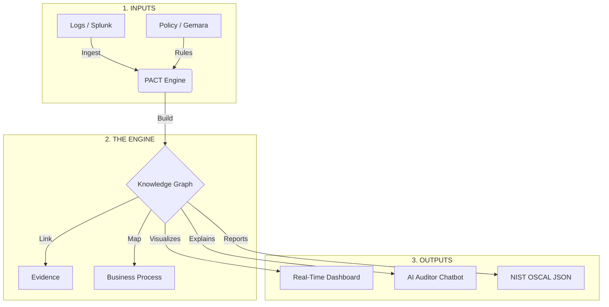

# PACT: Policy Automation and Compliance Traceability

**PACT** is an intelligent compliance engine that turns "audit checklists" into a living, queryable knowledge graph.

Instead of chasing spreadsheets and screenshots, PACT automatically:
1.  **Ingests** security logs (from Splunk, CloudTrail, etc.).
2.  **Checks** them against rules (NIST, PCI, ISO) defined as code.
3.  **Visualizes** the "Blast Radius" of every failure.
4.  **Detects** when a secure system "drifts" into non-compliance.
5.  **Proves** it all to auditors with immutable evidence links.

---

## Quick Start (Test Mode)

### Test Credentials

For testing and demonstration purposes, the following accounts are pre-configured:

| Role | Email | Password |
|------|-------|----------|
| **Admin** | `admin@pact.io` | `Admin@123!` |
| **Compliance Officer** | `compliance.officer@pact.io` | `Compliance@123!` |
| **Security Engineer** | `security@pact.io` | `Security@123!` |
| **Developer** | `developer@pact.io` | `Developer@123!` |
| **System Owner** | `sysowner@pact.io` | `SysOwner@123!` |
| **CISO** | `ciso@pact.io` | `ChiefSec@123!` |
| **Internal Auditor** | `auditor@pact.io` | `Auditor@123!` |
| **External Auditor** | `external@pact.io` | `External@123!` |
| **Product Manager** | `pm@pact.io` | `ProductMgr@123!` |

> **Warning:** These are TEST credentials only. In production, use the bootstrap endpoint to create your first admin user with a strong password.

---

## New in Version 2.0

### Role-Based Access Control (RBAC)

PACT now supports 9 distinct user roles with granular permissions:

- **Admin** - Full system access, user management, configuration
- **Compliance Officer** - Policy management, framework configuration, full compliance view
- **Security Engineer** - Technical remediation, vulnerability tracking, system configuration
- **Developer** - Code-related compliance issues, CI/CD integration
- **System Owner** - Manage owned systems, view compliance status
- **CISO** - Executive dashboards, risk overview, audit preparation
- **Internal Auditor** - Read-only access to all compliance data, evidence review
- **External Auditor** - Limited read-only access for third-party audits
- **Product Manager** - Product compliance status, release gates

### System Lifecycle Management

Track systems through their entire lifecycle:
- **Planned** → **Active** → **Deprecated** → **Archived**
- Assign ownership, backup owners, and team responsibilities
- Link systems to business processes and products

### Document & Evidence Management

- Upload policy documents, procedures, and manual evidence
- Version control for compliance documentation
- Expiration alerts for documents requiring periodic review
- Auditor evidence request workflows

### Historical "Time Machine"

- View compliance state at any point in time
- Compare compliance between two dates
- Track drift and remediation over time

### Incident Correlation

- Link security incidents to compliance gaps
- Track near-misses and their relationship to controls
- Measure control effectiveness over time

---

## The Problem vs. The Solution

| The Old Way (Manual Compliance) | The PACT Way (Semantic Compliance) |
| :--- | :--- |
| **Snapshot in Time:** "It was secure last month." | **Continuous:** "It became insecure 5 minutes ago." |
| **Spreadsheets:** Manual data entry & errors. | **Knowledge Graph:** Auto-generated relationships. |
| **Siloed:** Compliance doesn't know about Engineering. | **Unified:** Maps `Failed Control` → `Evidence Source`. |
| **Opaque:** "Why did we fail?" | **Traceable:** "We failed because of *this* log file." |

---

## Architecture: How It Works

PACT acts as the "Brain" between your Data (Logs) and your Rules (Policy). See the full **[System Architecture Documentation](docs/architecture.md)** for technical diagrams and data flow details.



### Key Components

1.  **The Graph:** We don't just store data; we store *context*. We know that `Server A` supports the `Payment Process` and is owned by `FinTech-Ops`.
2.  **The Rules (SHACL):** Policies are written in standard W3C shapes. We fully support rules generated by **Gemara** and **ComplyTime**.
3.  **The Drift Detector:** PACT remembers history. It can tell you: *"This system passed on Monday but failed on Tuesday."*
4.  **The Cross-Walk:** Fail a NIST control? PACT instantly tells you if that also violates **PCI-DSS**, **ISO 27001**, or **SOC 2**.

---

## The Ecosystem: UCO, Gemara, and ComplyTime

PACT doesn't operate in a vacuum. It is built on open standards to ensure interoperability across the cybersecurity industry.

### 1. UCO (Unified Cyber Ontology)
PACT uses **UCO** as its internal language. By mapping raw logs (like Splunk or AWS CloudTrail) into UCO observables, we ensure that a "File" or a "User" is defined the same way regardless of the source.

### 2. Gemara (Policy Compiler)
**Gemara** is the "legal translator" for PACT. While PACT executes the checks, Gemara is used to author and compile high-level regulatory guidance (like NIST SP 800-53) into the technical **SHACL rules** that PACT understands.

### 3. ComplyTime (Governance Lifecycle)
**ComplyTime** provides the broader context for digital trust. PACT feeds ComplyTime with real-time evidence and **NIST OSCAL** reports.

---

## Key Features

### 1. Blast Radius Analysis
Don't just fix a server; save a business process. PACT links low-level technical failures to high-level business impact with an **interactive visual diagram**.

The Blast Radius page shows a Mermaid flowchart visualizing:
- 🚨 **Violation Events** → The triggering compliance failures
- 🖥️ **Systems** → Affected information systems  
- ⚙️ **Business Processes** → Impacted operations
- 📋 **Frameworks** → Compliance frameworks at risk

> *"Warning: The failure on 'Payment Gateway' is blocking the 'Credit Card Processing' function."*

### 2. Temporal Drift Detection
Systems rot over time. PACT catches "Configuration Drift" by comparing today's graph against yesterday's—and tells you **who** did it and **why** it failed.

The Config Drift page shows:
- 📊 **Timeline Diagram** → Visual PASS → FAIL progression with actor attribution
- 📋 **Detail Cards** → WHAT happened, WHEN, WHO caused it, WHY it failed
- 🤖 **Ask AI** → One-click to ask the AI Auditor about the drift

> *"Alert: `sensitive_config.yaml` passed for 90 days, then `alice` changed ownership to `root` at 3:45 PM—violating NIST AC-3."*

### 3. AI Auditor
Ask plain English questions to your compliance data.

*   **User:** *"Why is the HR Portal failing?"*
*   **PACT AI:** *"The HR Portal failed NIST AC-3 because `critical_secrets.yaml` is world-readable. This also violates PCI Req 7.1."*

### 4. Automated Reporting (OSCAL)
Stop writing Word docs. PACT exports a valid **NIST OSCAL** Assessment Results file, ready for submission to FedRAMP, eMASS, or ComplyTime.

---

## Getting Started

### Prerequisites
*   Python 3.10+ ([python.org](https://www.python.org/downloads/))
*   Git
*   **Ollama** (Recommended for Local AI) or OpenAI API Key

### Local AI Setup (Beginner Friendly)
PACT uses a local AI to help you understand your compliance data without sending your data to the cloud.

1.  **Download Ollama:** Go to [ollama.com](https://ollama.com) and download for your OS.
2.  **Install the Model:**
    ```bash
    ollama run granite3.3:8b
    ```
3.  **Keep it Running:**
    - **macOS:** Ollama runs in the menu bar automatically
    - **Windows:** Ollama runs in the system tray automatically
    - **Linux:** Run `ollama serve` in a separate terminal

### Installation

**Clone and setup:**
```bash
# Clone the repo
git clone https://github.com/your-org/pact.git
cd pact

# Create virtual environment
python -m venv venv
```

**Activate virtual environment:**

| OS | Command |
|----|---------|
| **macOS/Linux** | `source venv/bin/activate` |
| **Windows (CMD)** | `venv\Scripts\activate.bat` |
| **Windows (PowerShell)** | `venv\Scripts\Activate.ps1` |

**Install dependencies:**
```bash
pip install -r requirements.txt
```

### Running the Server

| OS | Command |
|----|---------|
| **macOS/Linux** | `uvicorn app.main:app --host 0.0.0.0 --port 8002 --reload` |
| **Windows** | `uvicorn app.main:app --host 0.0.0.0 --port 8002 --reload` |

> **Note:** After activating the virtual environment, `uvicorn` is available in your PATH on all platforms.

### First-Time Setup (Bootstrap)

If this is a fresh installation with no users, bootstrap the first admin.

> **Note:** Bootstrap only works when the database has zero users. After the first admin is created, use the dashboard or API to add more users.

```bash
curl -X POST http://localhost:8002/v1/auth/bootstrap \
  -H "Content-Type: application/json" \
  -d '{
    "email": "admin@yourcompany.com",
    "password": "YourSecurePassword123!",
    "full_name": "System Administrator",
    "role": "admin"
  }'
```

### Access the Dashboard

1. Navigate to [http://localhost:8002/visualize](http://localhost:8002/visualize)
2. Log in with your credentials (or use test credentials above)
3. Explore the dashboard based on your role

---

## Configuration

### Environment Variables

| Variable | Description | Default |
|----------|-------------|---------|
| `PACT_API_KEY` | Legacy API key for machine-to-machine auth (optional) | None (disabled) |
| `OPENAI_API_KEY` | OpenAI API key for cloud AI | None |
| `OLLAMA_HOST` | Ollama server URL | `http://localhost:11434/v1` |
| `AI_MODEL` | AI model to use | `granite3.3:8b` |
| `CORS_ALLOW_ORIGINS` | Allowed CORS origins (comma-separated) | `*` |
| `ENABLE_DOCS` | Enable Swagger/ReDoc at `/docs` | `true` |
| `TRUSTED_HOSTS` | Allowed host headers | `localhost,127.0.0.1` |
| `DEBUG` | Enable debug logging | `false` |
| `ENABLE_HSTS` | Enable HTTP Strict Transport Security | `false` |

### Authentication Modes

PACT supports two authentication mechanisms:

1. **JWT Authentication (Primary)** - For users and the dashboard
   - Login via `POST /v1/auth/login` to get access/refresh tokens
   - Include `Authorization: Bearer <token>` header on requests
   - Tokens expire after 15 minutes; use refresh token to renew

2. **Legacy API Key (Optional)** - For CI/CD and scripts
   - Set `PACT_API_KEY` environment variable
   - Include `X-API-Key: <key>` header on requests
   - Excluded paths (no key required): `/`, `/health`, `/docs`, `/visualize*`, `/v1/auth/*`

---

## Quickstart (API)

Here are curl examples to get started quickly:

```bash
# Login and get token
TOKEN=$(curl -s -X POST http://localhost:8002/v1/auth/login \
  -H "Content-Type: application/json" \
  -d '{"email":"admin@pact.io","password":"Admin@123!"}' | jq -r .access_token)

# Ingest security events
curl -X POST http://localhost:8002/v1/ingest \
  -H "Authorization: Bearer $TOKEN" \
  -H "Content-Type: application/json" \
  -d '{
    "events": [
      {"type": "file_access", "file": "/etc/shadow", "permission": "0644", "system": "hr-portal"},
      {"type": "network_connection", "port": 23, "protocol": "tcp", "system": "payment-gateway"}
    ]
  }'

# Get blast radius (compliance failures)
curl -s http://localhost:8002/v1/compliance/blast-radius \
  -H "Authorization: Bearer $TOKEN" | jq

# Get configuration drift
curl -s http://localhost:8002/v1/compliance/drift \
  -H "Authorization: Bearer $TOKEN" | jq

# Ask the AI Auditor
curl -X POST http://localhost:8002/v1/chat \
  -H "Authorization: Bearer $TOKEN" \
  -H "Content-Type: application/json" \
  -d '{"question": "What controls are currently failing and why?"}'

# Export OSCAL report
curl -s http://localhost:8002/v1/export/oscal \
  -H "Authorization: Bearer $TOKEN" -o oscal-report.json
```

---

## API Reference

PACT exposes a RESTful API at `/v1/`. Key endpoints:

| Category | Endpoints | Description |
|----------|-----------|-------------|
| **Authentication** | `POST /v1/auth/login`, `/refresh`, `/bootstrap` | JWT authentication and registration |
| **Users** | `GET/POST/PATCH/DELETE /v1/users` | User management (Admin only) |
| **Systems** | `GET/POST/PATCH/DELETE /v1/systems` | System lifecycle management |
| **Documents** | `GET/POST /v1/documents` | Evidence and document management |
| **Policies** | `GET/POST/PATCH/DELETE /v1/policies` | Policy and SHACL rule management |
| **Vendors** | `GET/POST/PATCH/DELETE /v1/vendors` | Third-party vendor risk tracking |
| **Incidents** | `GET/POST/PATCH/DELETE /v1/incidents` | Security incident tracking |
| **Compliance** | `GET /v1/compliance/blast-radius`, `/drift`, `/stats`, `/threats` | Compliance data and analysis |
| **History** | `GET /v1/history/at`, `/timeline`, `/compare` | Historical compliance views |
| **Export** | `GET /v1/export/oscal` | OSCAL Assessment Results export |
| **Chat** | `POST /v1/chat` | AI Auditor queries |
| **Ingest** | `POST /v1/ingest` | Ingest security events |
| **Schedules** | `GET/POST /v1/schedules` | Recurring assessment schedules |
| **WebSocket** | `WS /v1/ws` | Real-time compliance updates |

Full API documentation available at [http://localhost:8002/docs](http://localhost:8002/docs)

---

## Documentation

| Document | Description |
|----------|-------------|
| [User Guide](docs/user-guide.md) | How to use PACT for compliance monitoring |
| [Administrator Guide](docs/administrator-guide.md) | Installation, configuration, and maintenance |
| [Architecture](docs/architecture.md) | Technical architecture and data flows |
| [API Reference](http://localhost:8002/docs) | Interactive Swagger documentation |

---

## Integrations

*   **Gemara:** We natively consume SHACL rules compiled by the Gemara Policy Compiler. *(Optional - chat works without it)*
*   **ComplyTime:** We export results that fit into the ComplyTime lifecycle.
*   **Splunk / OCSF:** We ingest standard JSON security logs.
*   **CI/CD:** API-first design enables integration with GitHub Actions, GitLab CI, etc.

---

## Troubleshooting

| Error | Cause | Solution |
|-------|-------|----------|
| `401 Unauthorized` | Invalid or expired token | Re-login via `/v1/auth/login` |
| `Invalid or missing API key` | `PACT_API_KEY` set but not provided | Add `X-API-Key` header or unset env var |
| `Ollama connection failed` | Ollama not running | Start with `ollama serve` or check `OLLAMA_HOST` |
| `CORS policy blocked` | Browser cross-origin issue | Set `CORS_ALLOW_ORIGINS` to your frontend URL |
| `No users exist` | Fresh installation | Use bootstrap endpoint (works only once) |
| `Database locked` | Concurrent SQLite access | Use PostgreSQL for production |
| AI returns generic answers | No graph context | Ingest events first via `/v1/ingest` |

### Common Setup Issues

**Ollama not responding:**
```bash
# Check if Ollama is running
curl http://localhost:11434/api/version

# Start Ollama
ollama serve

# Pull the model if needed
ollama pull granite3.3:8b
```

**Database auto-initialization:**
The SQLite database (`db/pact.db`) is created automatically on first run. If no users exist, a default admin account is created with a temporary password shown in the console.

---

## Demo Scope

The current release is optimized for demonstration and evaluation:

| Feature | Status |
|---------|--------|
| Event types | `file_access`, `network_connection` supported |
| Systems | Demo includes HR Portal, Payment Gateway |
| Frameworks | NIST 800-53, PCI-DSS 4.0, ISO 27001 mappings |
| AI Auditor | Full graph context + natural language |
| OSCAL Export | Complete Assessment Results format |

For production deployments, see the [Administrator Guide](docs/administrator-guide.md).

---

## License

Licensed under the Apache License, Version 2.0. See [LICENSE](LICENSE) for the full license text.

```
Copyright 2026 PACT Contributors

Licensed under the Apache License, Version 2.0 (the "License");
you may not use this file except in compliance with the License.
You may obtain a copy of the License at

    http://www.apache.org/licenses/LICENSE-2.0
```
