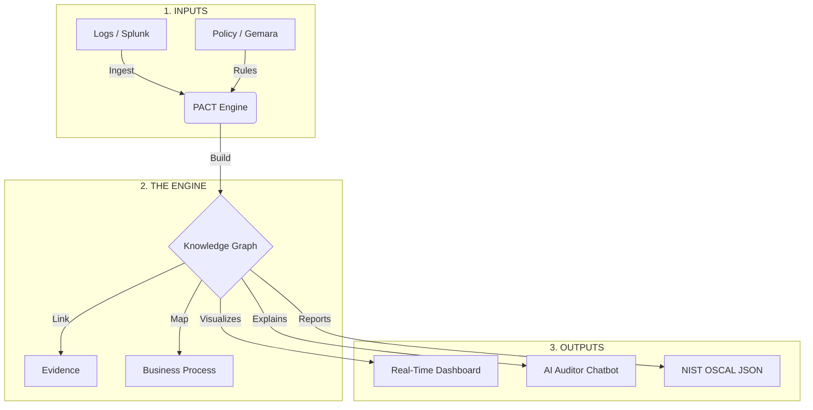

# PACT: Policy Automation and Compliance Traceability

**PACT** is an intelligent compliance engine that turns "audit checklists" into a living, queryable knowledge graph.

Instead of chasing spreadsheets and screenshots, PACT automatically:
1.  **Ingests** security logs (from Splunk, CloudTrail, etc.).
2.  **Checks** them against rules (NIST, PCI, ISO) defined as code.
3.  **Visualizes** the "Blast Radius" of every failure.
4.  **Detects** when a secure system "drifts" into non-compliance.
5.  **Proves** it all to auditors with immutable evidence links.

---

## 🎯 The Problem vs. The Solution

| The Old Way (Manual Compliance) | The PACT Way (Semantic Compliance) |
| :--- | :--- |
| ❌ **Snapshot in Time:** "It was secure last month." | ✅ **Continuous:** "It became insecure 5 minutes ago." |
| ❌ **Spreadsheets:** Manual data entry & errors. | ✅ **Knowledge Graph:** Auto-generated relationships. |
| ❌ **Siloed:** Compliance doesn't know about Engineering. | ✅ **Unified:** Maps `Failed Control` $\to$ `Git Commit`. |
| ❌ **Opaque:** "Why did we fail?" | ✅ **Traceable:** "We failed because of *this* log file." |

---

## 🏗️ Architecture: How It Works

PACT acts as the "Brain" between your Data (Logs) and your Rules (Policy). See the full **[System Architecture Documentation](docs/architecture.md)** for technical diagrams and data flow details.

---

## 🌐 The Ecosystem: UCO, Gemara, and ComplyTime

PACT doesn't operate in a vacuum. It is built on open standards to ensure interoperability across the cybersecurity industry.

### 1. **UCO (Unified Cyber Ontology)**
PACT uses **UCO** as its internal language. By mapping raw logs (like Splunk or AWS CloudTrail) into UCO observables, we ensure that a "File" or a "User" is defined the same way regardless of the source. This allows PACT to reason across different vendors and platforms without custom code for every integration.

### 2. **Gemara (Policy Compiler)**
**Gemara** is the "legal translator" for PACT. While PACT executes the checks, Gemara is used to author and compile high-level regulatory guidance (like NIST SP 800-53) into the technical **SHACL rules** that PACT understands. If Gemara is the *lawmaker*, PACT is the *enforcer*.

### 3. **ComplyTime (Governance Lifecycle)**
**ComplyTime** provides the broader context for digital trust. PACT feeds ComplyTime with real-time evidence and **NIST OSCAL** reports. While ComplyTime manages the overall compliance posture and risk management lifecycle, PACT provides the ground-truth technical validation that powers it.

---



### Key Components

1.  **The Graph:** We don't just store data; we store *context*. We know that `Server A` supports the `Payment Process` and is owned by `FinTech-Ops`.
2.  **The Rules (SHACL):** Policies are written in standard W3C shapes. We fully support rules generated by **Gemara** and **ComplyTime**.
3.  **The Drift Detector:** PACT remembers history. It can tell you: *"This system passed on Monday but failed on Tuesday."*
4.  **The Cross-Walk:** Fail a NIST control? PACT instantly tells you if that also violates **PCI-DSS**, **ISO 27001**, or **SOC 2**.

---

## 🚀 Key Features

### 1. Blast Radius Analysis
Don't just fix a server; save a business process. PACT links low-level technical failures to high-level business impact.

> *"Warning: The failure on 'Payment Gateway' is blocking the 'Credit Card Processing' function."*

### 2. Temporal Drift Detection
Systems rot over time. PACT catches "Configuration Drift" by comparing today's graph against yesterday's.

> *"Alert: `sensitive_config.yaml` passed checks for 90 days but was changed by `root` at 3:45 PM today."*

### 3. AI Auditor 🤖
Ask plain English questions to your compliance data.

*   **User:** *"Why is the HR Portal failing?"*
*   **PACT AI:** *"The HR Portal failed NIST AC-3 because `critical_secrets.yaml` is world-readable. This also violates PCI Req 7.1."*

### 4. Automated Reporting (OSCAL)
Stop writing Word docs. PACT exports a valid **NIST OSCAL** Assessment Results file, ready for submission to FedRAMP, eMASS, or ComplyTime.

---

## 🛠️ Getting Started

### Prerequisites
*   Python 3.10+
*   **Ollama** (Recommended for Local AI) or OpenAI API Key

### Local AI Setup (Beginner Friendly)
PACT uses a local AI to help you understand your compliance data without sending your data to the cloud. **You must have Ollama installed and running for the AI Auditor to work.**

1.  **Download Ollama:** Go to [ollama.com](https://ollama.com) and download the app for your computer (available for Mac, Windows, and Linux).
2.  **Open your Terminal:** 
    *   **Mac:** Press `Command + Space` and type "Terminal".
    *   **Windows:** Press the `Start` key and type "PowerShell" or "Command Prompt".
3.  **Install the Model:** In the terminal window, type exactly this and press Enter:
    ```bash
    ollama run granite3.3:8b
    ```
    *This will download the AI brain. It may take a few minutes depending on your internet speed.*
4.  **Keep it Running:** Make sure the Ollama app icon is visible in your menu bar or system tray. PACT talks to this app to generate answers.

### Installation
```bash
# Clone the repo
git clone https://github.com/your-org/pact.git
cd pact

# Install dependencies
pip install -r requirements.txt
```

### Running the Demo
1.  **Start the PACT Server:**
    ```bash
    ./venv/bin/uvicorn app.main:app --host 0.0.0.0 --port 8000 --reload
    ```
2.  **Open the Dashboard:**
    Navigate to [http://localhost:8000/visualize/](http://localhost:8000/visualize/) in your browser.
3.  **Simulate an Attack:**
    Click **"Simulate Event"** in the UI to see the graph update in real-time.

---

## 🔗 Integrations

*   **Gemara:** We natively consume SHACL rules compiled by the Gemara Policy Compiler.
*   **ComplyTime:** We export results that fit into the ComplyTime lifecycle.
*   **Splunk / OCSF:** We ingest standard JSON security logs.

---

## 📜 License
MIT License. Open Source and ready for the community.
