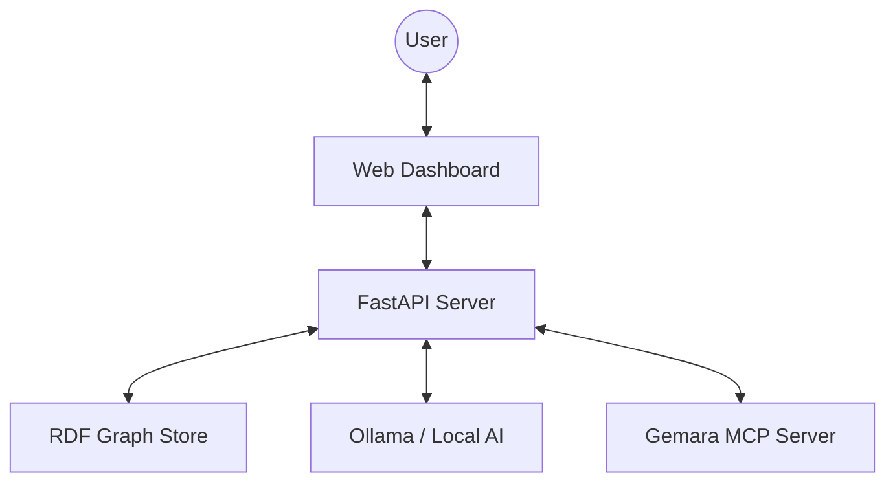
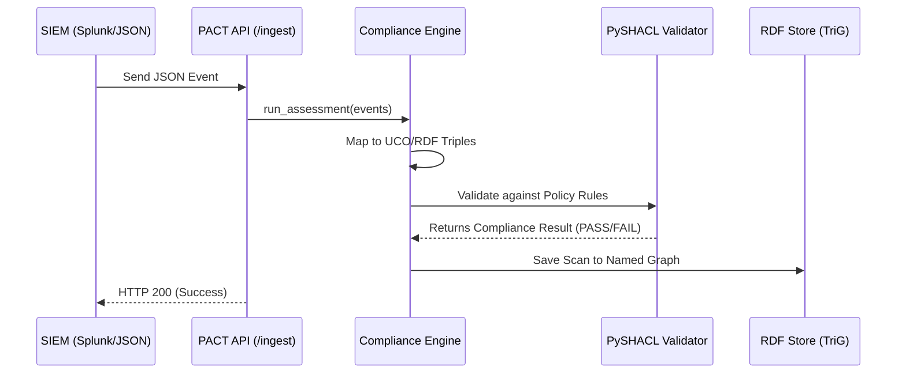
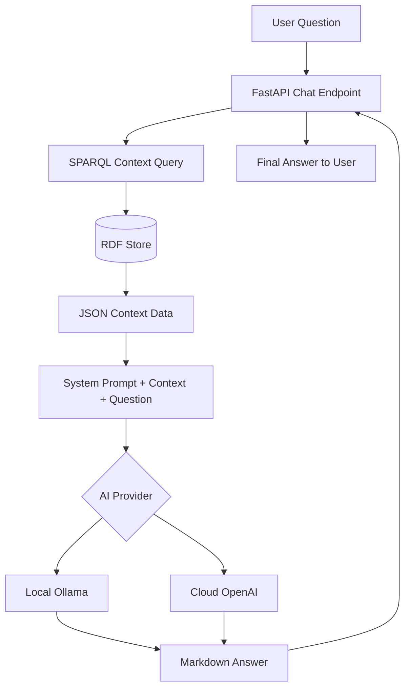
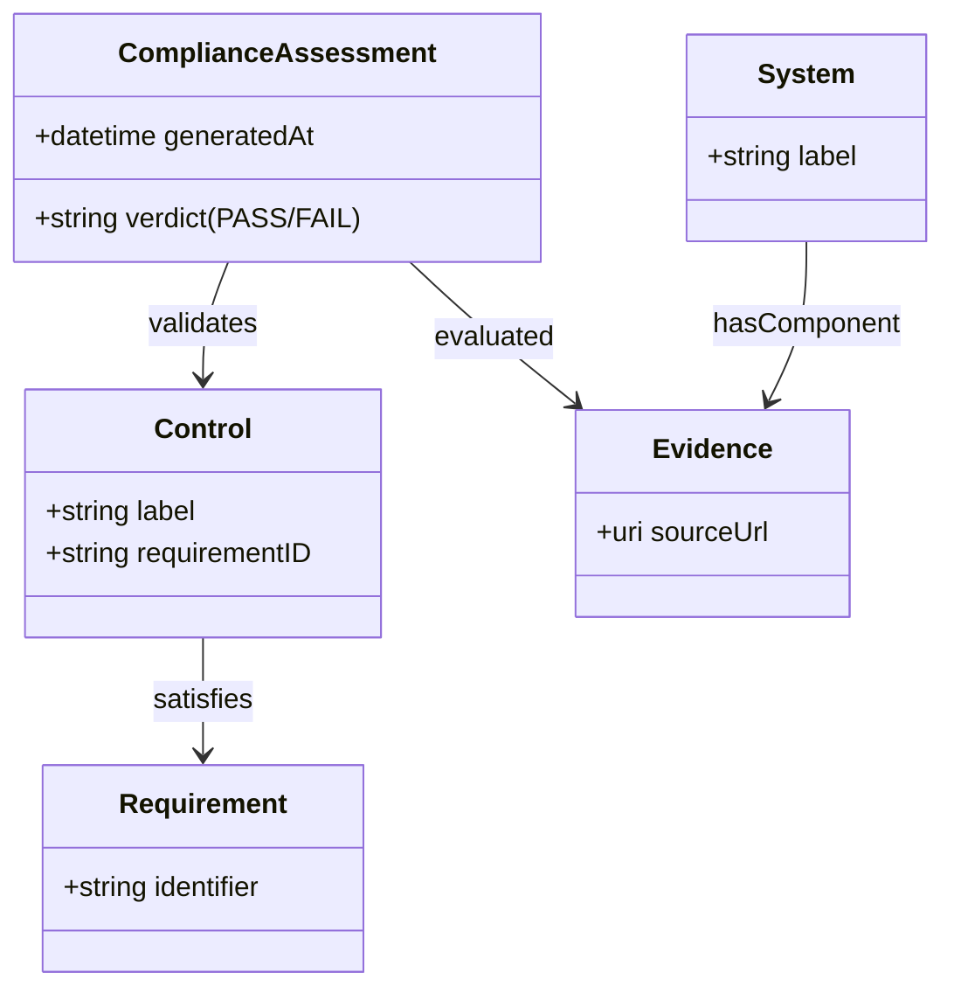

# PACT System Architecture

This document describes the technical architecture of **PACT** (Policy Automation and Compliance Traceability).

## 1. High-Level Ecosystem

PACT is built on a "Semantic-First" philosophy, where every security event, compliance control, and business process is represented as a node in a Knowledge Graph.

---

## 2. Core Components

### **A. API Layer (`app/api/v1/`)**
A modular FastAPI application providing versioned endpoints for:
-   **`/ingest`**: Entry point for security logs.
-   **`/compliance`**: Retrieval of blast radius, drift, and threat data.
-   **`/chat`**: Interface for the AI Auditor.
-   **`/visualize`**: Serving the dashboard UI.

### **B. Compliance Engine (`app/core/engine.py`)**
The "Brain" of PACT. It maps incoming JSON data to the **Unified Cyber Ontology (UCO)** and executes **SHACL (Shapes Constraint Language)** rules to determine compliance status.

### **C. Semantic Store (`app/core/store.py`)**
A persistent RDF Graph database powered by **RDFLib**. 
-   **Format**: TriG (Triples in Graphs).
-   **Temporal Tracking**: Every scan is stored in a unique **Named Graph**, allowing PACT to detect "Drift" by comparing graphs across time.

### **D. AI Auditor (`app/api/v1/endpoints/chat.py`)**
A hybrid inference client that uses **SPARQL** to pull context from the graph and injects it into a LLM prompt. It supports:
-   **Local Mode**: Direct HTTP communication with **Ollama** (Model: `granite3.3:8b`).
-   **Cloud Mode**: Integration with **OpenAI GPT-4o**.
-   **MCP Integration**: Connects to the **Gemara MCP Server** to use specialized GRC tools.

---

## 3. Data Flow Diagrams

### **Ingestion & Validation Pipeline**
This flow transforms raw logs into actionable compliance intelligence.

### **AI Auditor Query Flow**
How PACT answers questions like *"Why is the Payment Gateway failing?"*

---

## 4. Semantic Data Model

PACT uses a specialized ontology extending **UCO** to link technical evidence to regulatory requirements.

---

## 5. Technology Stack

| Category | Technology |
| :--- | :--- |
| **Language** | Python 3.14+ |
| **Web Framework** | FastAPI / Uvicorn |
| **Knowledge Graph** | RDFLib (SPARQL 1.1) |
| **Policy Language** | W3C SHACL |
| **AI (Local)** | Ollama (IBM Granite 3.3) |
| **AI (Cloud)** | OpenAI (GPT-4o) |
| **Protocol** | Model Context Protocol (MCP) |
| **Governance** | Gemara Policy Compiler |
