# PACT System Architecture

This document describes the technical architecture of **PACT** (Policy Automation and Compliance Traceability).

---

## Table of Contents

1. [High-Level Ecosystem](#1-high-level-ecosystem)
2. [Core Components](#2-core-components)
3. [Data Flow Diagrams](#3-data-flow-diagrams)
4. [Authentication & Authorization](#4-authentication--authorization)
5. [Database Architecture](#5-database-architecture)
6. [Semantic Data Model](#6-semantic-data-model)
7. [API Reference](#7-api-reference)
8. [Real-Time Updates](#8-real-time-updates)
9. [Technology Stack](#9-technology-stack)

---

## 1. High-Level Ecosystem

PACT is built on a "Semantic-First" philosophy, where every security event, compliance control, and business process is represented as a node in a Knowledge Graph.

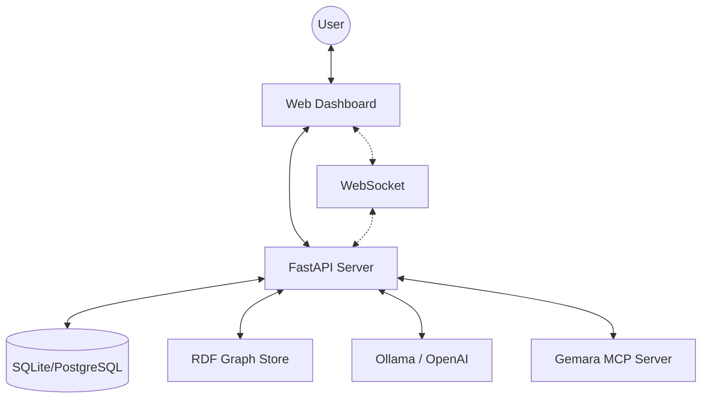

### System Boundaries

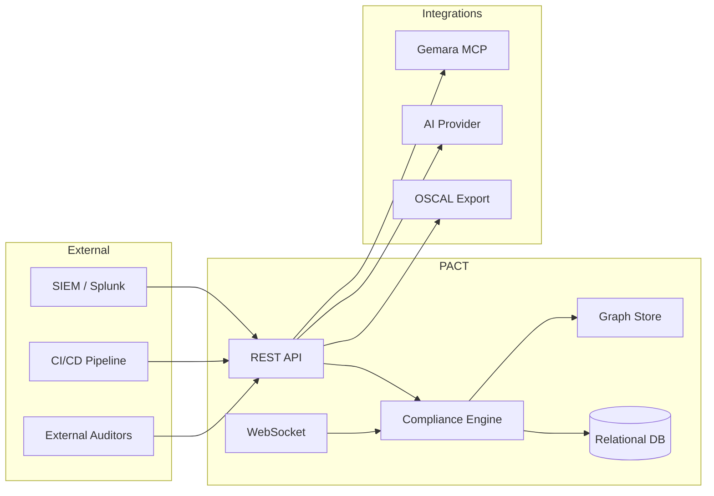

---

## 2. Core Components

### **A. API Layer (`app/api/v1/`)**

A modular FastAPI application providing versioned endpoints organized by domain:

| Module | Purpose |
|--------|---------|
| `auth.py` | JWT authentication, login, registration, token refresh |
| `users.py` | User CRUD, role management, team assignment |
| `systems.py` | System lifecycle (planned → active → deprecated → archived) |
| `compliance.py` | Blast radius, drift detection, statistics |
| `documents.py` | Evidence upload, versioning, auditor requests |
| `incidents.py` | Security incidents, near-misses, correlation |
| `policies.py` | Policy management, SHACL rule upload |
| `vendors.py` | Third-party vendor risk tracking |
| `history.py` | Time-travel queries, compliance comparison |
| `chat.py` | AI Auditor natural language interface |
| `ingest.py` | Security event ingestion |
| `export.py` | OSCAL report generation |
| `catalog.py` | Dynamic catalog of systems, frameworks, controls |
| `scans.py` | Scan history and results |
| `sbom.py` | Software Bill of Materials management |
| `schedules.py` | Recurring assessment scheduling |
| `notifications.py` | Alert preferences and delivery |
| `websocket.py` | Real-time update subscriptions |

### **B. Compliance Engine (`app/core/engine.py`)**

The "Brain" of PACT. It maps incoming JSON data to the **Unified Cyber Ontology (UCO)** and executes **SHACL (Shapes Constraint Language)** rules to determine compliance status.

**Key Responsibilities:**
- Parse incoming security events (file access, network connections, etc.)
- Map events to RDF triples using UCO vocabulary
- Execute SHACL validation against policy rules
- Generate compliance verdicts (PASS/FAIL)
- Create evidence links for audit trails

### **C. Semantic Store (`app/core/store.py`)**

A persistent RDF Graph database powered by **RDFLib**.

- **Format**: TriG (Triples in Graphs)
- **Temporal Tracking**: Every scan is stored in a unique **Named Graph**, allowing PACT to detect "Drift" by comparing graphs across time
- **Thread-Safe**: Mutex-protected read/write operations
- **Persistence**: Automatic save on graph updates

### **D. Relational Database (`app/core/database.py`)**

SQLAlchemy-based relational storage for structured data:

- **Users & Teams**: Authentication, roles, permissions
- **Systems**: Asset inventory with lifecycle states
- **Documents**: Evidence files with metadata
- **Incidents**: Security events and correlations
- **Audit Logs**: Complete action history

### **E. AI Auditor (`app/api/v1/endpoints/chat.py`)**

A hybrid inference client that uses **SPARQL** to pull context from the graph and injects it into an LLM prompt.

**Supported Providers:**
- **Local Mode**: Direct HTTP to **Ollama** (Model: `granite3.3:8b`)
- **Cloud Mode**: OpenAI API (GPT-4)
- **MCP Integration**: Connects to **Gemara MCP Server** for specialized GRC tools

---

## 3. Data Flow Diagrams

### **Ingestion & Validation Pipeline**

This flow transforms raw logs into actionable compliance intelligence.

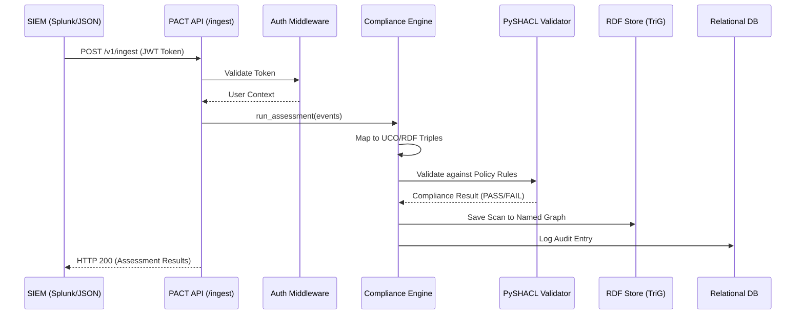

### **AI Auditor Query Flow**

How PACT answers questions like *"Why is the Payment Gateway failing?"*

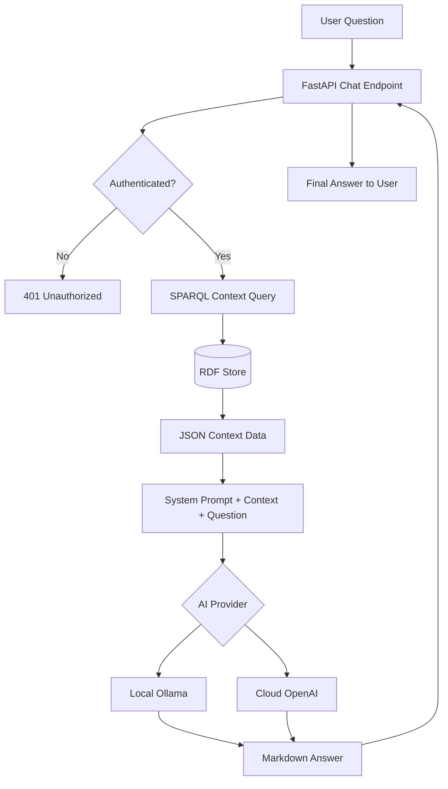

### **Document Evidence Flow**

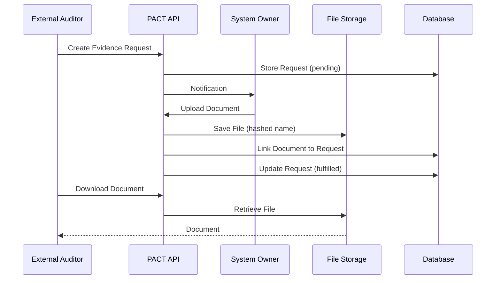

---

## 4. Authentication & Authorization

### **JWT-Based Authentication**

PACT uses JSON Web Tokens for stateless authentication.

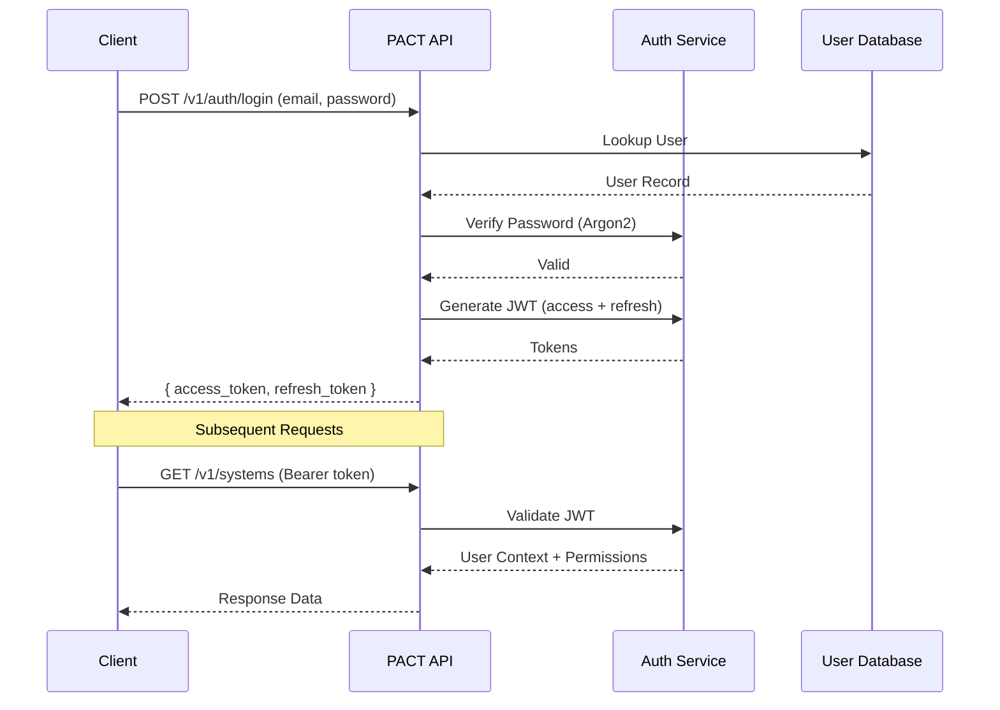

### **Token Lifecycle**

| Token Type | Expiry | Purpose |
|------------|--------|---------|
| Access Token | 15 minutes | API authentication |
| Refresh Token | 7 days | Obtain new access tokens |

### **Role-Based Access Control (RBAC)**

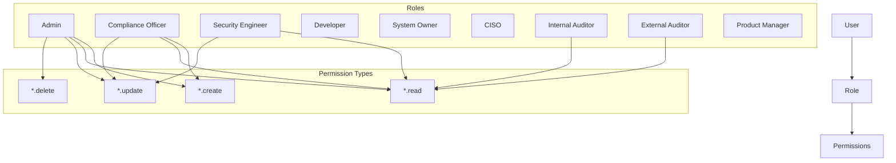

### **Permission Matrix**

| Permission | Admin | Compliance | Security | Developer | Owner | CISO | Auditors |
|------------|:-----:|:----------:|:--------:|:---------:|:-----:|:----:|:--------:|
| `users.*` | ✓ | - | - | - | - | - | - |
| `systems.create` | ✓ | ✓ | - | - | - | - | - |
| `systems.read` | ✓ | ✓ | ✓ | ✓ | Own | ✓ | ✓ |
| `systems.update` | ✓ | ✓ | ✓ | - | Own | - | - |
| `policies.*` | ✓ | ✓ | - | - | - | - | R |
| `documents.upload` | ✓ | ✓ | ✓ | ✓ | ✓ | - | - |
| `documents.read` | ✓ | ✓ | ✓ | ✓ | ✓ | ✓ | ✓ |
| `incidents.*` | ✓ | ✓ | ✓ | - | - | R | R |
| `export.oscal` | ✓ | ✓ | - | - | - | ✓ | ✓ |
| `ai.chat` | ✓ | ✓ | ✓ | ✓ | ✓ | ✓ | ✓ |

---

## 5. Database Architecture

### **Dual-Database Design**

PACT uses two complementary storage systems:

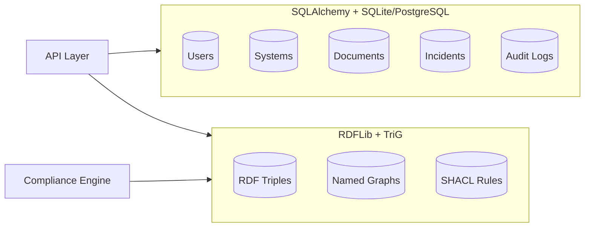

### **Relational Schema (ERD)**

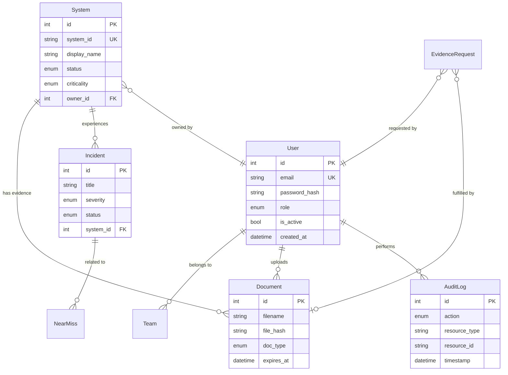

### **Knowledge Graph Structure**

```
db/pact_history.trig
├── Named Graph: scan:2026-01-06T10:30:00
│   ├── Assessment results
│   ├── Evidence links
│   └── Control verdicts
├── Named Graph: scan:2026-01-06T14:45:00
│   └── (newer scan data)
└── Default Graph
    ├── System definitions
    ├── Framework mappings
    └── Threat intelligence
```

---

## 6. Semantic Data Model

PACT uses a specialized ontology extending **UCO** (Unified Cyber Ontology) to link technical evidence to regulatory requirements.

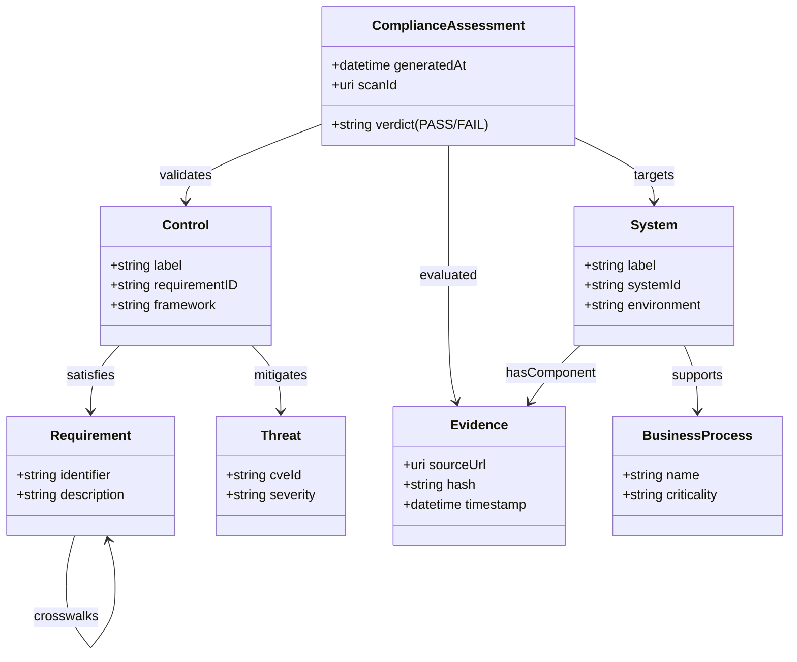

### **Namespace Prefixes**

| Prefix | URI | Purpose |
|--------|-----|---------|
| `pact:` | `http://your-org.com/ns/pact#` | PACT-specific terms |
| `uco-obs:` | `https://ontology.unifiedcyberontology.org/uco/observable/` | UCO observables |
| `rdfs:` | `http://www.w3.org/2000/01/rdf-schema#` | RDF Schema |
| `xsd:` | `http://www.w3.org/2001/XMLSchema#` | XML Schema datatypes |

---

## 7. API Reference

### **Endpoint Categories**

```mermaid
flowchart TD
    subgraph Auth [Authentication]
        Login[POST /auth/login]
        Refresh[POST /auth/refresh]
        Logout[POST /auth/logout]
    end
    
    subgraph Resources [Resource Management]
        Users[/users]
        Systems[/systems]
        Documents[/documents]
        Incidents[/incidents]
        Policies[/policies]
        Vendors[/vendors]
    end
    
    subgraph Compliance [Compliance Operations]
        Blast[GET /compliance/blast-radius]
        Drift[GET /compliance/drift]
        Stats[GET /compliance/stats]
        Threats[GET /compliance/threats]
    end
    
    subgraph Intelligence [AI & Analysis]
        Chat[POST /chat]
        History[/history/*]
        Export[GET /export/oscal]
    end
    
    subgraph Ingest [Data Ingestion]
        Events[POST /ingest]
        Scans[/scans]
        SBOM[/sbom]
    end
```

### **Full Endpoint List**

| Method | Endpoint | Auth | Description |
|--------|----------|:----:|-------------|
| POST | `/v1/auth/login` | - | Authenticate user |
| POST | `/v1/auth/refresh` | - | Refresh access token |
| POST | `/v1/auth/logout` | ✓ | Invalidate tokens |
| POST | `/v1/auth/bootstrap` | - | Create first admin |
| GET | `/v1/users` | Admin | List all users |
| POST | `/v1/users` | Admin | Create user |
| GET | `/v1/users/{id}` | Admin | Get user details |
| PATCH | `/v1/users/{id}` | Admin | Update user |
| DELETE | `/v1/users/{id}` | Admin | Soft-delete user |
| GET | `/v1/systems` | ✓ | List systems |
| POST | `/v1/systems` | ✓ | Create system |
| GET | `/v1/systems/{id}` | ✓ | Get system details |
| PATCH | `/v1/systems/{id}` | ✓ | Update system |
| POST | `/v1/systems/{id}/deprecate` | ✓ | Deprecate system |
| POST | `/v1/systems/{id}/archive` | ✓ | Archive system |
| GET | `/v1/compliance/blast-radius` | ✓ | Get compliance failures |
| GET | `/v1/compliance/drift` | ✓ | Get configuration drift |
| GET | `/v1/compliance/stats` | ✓ | Get graph statistics |
| GET | `/v1/compliance/threats` | ✓ | Get threat mitigations |
| POST | `/v1/ingest` | ✓ | Ingest security events |
| POST | `/v1/chat` | ✓ | Query AI Auditor |
| GET | `/v1/documents` | ✓ | List documents |
| POST | `/v1/documents` | ✓ | Upload document |
| GET | `/v1/documents/{id}/download` | ✓ | Download document |
| GET | `/v1/incidents` | ✓ | List incidents |
| POST | `/v1/incidents` | ✓ | Create incident |
| GET | `/v1/history/at` | ✓ | Compliance at point in time |
| GET | `/v1/history/compare` | ✓ | Compare two dates |
| GET | `/v1/export/oscal` | ✓ | Export OSCAL report |
| GET | `/v1/catalog` | ✓ | Get dynamic catalog |
| WS | `/v1/ws` | ✓ | Real-time updates |

---

## 8. Real-Time Updates

### **WebSocket Architecture**

PACT provides real-time updates via WebSocket connections for live dashboard updates.

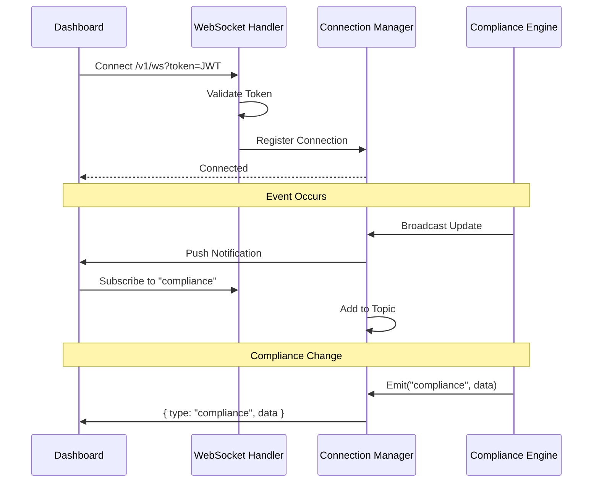

### **Available Topics**

| Topic | Events |
|-------|--------|
| `compliance` | New assessment results, status changes |
| `alerts` | Critical failures, threshold breaches |
| `systems` | System status changes, lifecycle events |
| `all` | All events (for dashboards) |

### **Message Format**

```json
{
  "type": "compliance",
  "timestamp": "2026-01-06T15:30:00Z",
  "data": {
    "event": "assessment_complete",
    "scan_id": "scan:2026-01-06T15:30:00",
    "summary": {
      "passed": 45,
      "failed": 3,
      "systems_affected": ["payment-gateway"]
    }
  }
}
```

---

## 9. Technology Stack

| Category | Technology | Version |
|----------|------------|---------|
| **Language** | Python | 3.10+ |
| **Web Framework** | FastAPI | 0.115.0 |
| **ASGI Server** | Uvicorn | 0.30.6 |
| **Database ORM** | SQLAlchemy | 2.0.35 |
| **Database (Dev)** | SQLite | 3.x |
| **Database (Prod)** | PostgreSQL | 14+ |
| **Async DB Driver** | aiosqlite | 0.20.0 |
| **Knowledge Graph** | RDFLib | 7.0.0 |
| **Policy Language** | PySHACL | 0.25.0 |
| **Authentication** | python-jose | 3.3.0 |
| **Password Hashing** | Argon2 | 23.1.0 |
| **Validation** | Pydantic | 2.9.2 |
| **AI (Local)** | Ollama | granite3.3:8b |
| **AI (Cloud)** | OpenAI | GPT-4 |
| **Protocol** | MCP | 1.1.2 |
| **HTTP Client** | httpx | 0.27.2 |

---

## Appendix: Deployment Considerations

### **Development**

```bash
uvicorn app.main:app --reload --port 8002
```

### **Production**

```bash
# With Gunicorn + Uvicorn workers
gunicorn app.main:app -w 4 -k uvicorn.workers.UvicornWorker -b 0.0.0.0:8002

# Or with Docker
docker run -d -p 8002:8002 \
  -e DATABASE_URL="postgresql://..." \
  -e JWT_SECRET_KEY="..." \
  pact:latest
```

### **Scaling Considerations**

| Component | Scaling Strategy |
|-----------|------------------|
| API Server | Horizontal (multiple workers/containers) |
| PostgreSQL | Vertical or read replicas |
| RDF Store | Single instance (file-based) or SPARQL endpoint |
| AI Inference | GPU-enabled nodes for Ollama |

---

*Last updated: January 2026*
